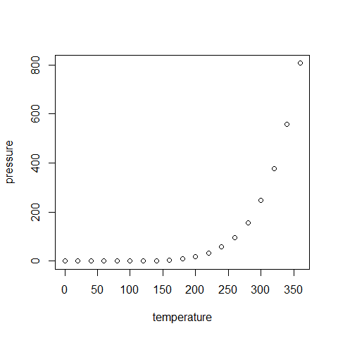

# Module 3 HTML Document

## R Markdown {#nextsteps .emphasized}

This is an R Markdown document. Markdown is a simple formatting syntax for authoring HTML, PDF, and MS Word documents. For more details on using R Markdown see <http://rmarkdown.rstudio.com>.

When you click the **Knit** button a document will be generated that includes both content as well as the output of any embedded R code chunks within the document. You can embed an R code chunk like this:

### Plot of the Cars Dataset


```r
plot(cars)
```

<!-- -->

## Including Plots

You can also embed plots, for example:

### Plot of the Pressure Dataset

<!-- -->

Note that the `echo = FALSE` parameter was added to the code chunk to prevent printing of the R code that generated the plot.

## A short list

* apples
* bananas
* oranges

## A simple equation

$$ Y = \beta_0 + \beta_1*X $$
